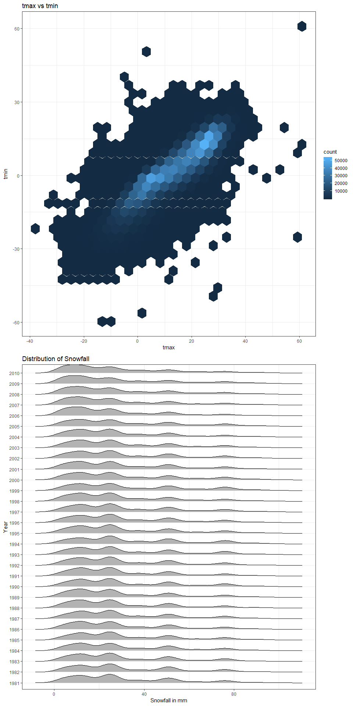

p8105\_hw2\_st3117
================
Sha Tao
October 6, 2018

Problem 1\_1 BRFSS Data Cleaning
--------------------------------

``` r
brfss = 
  brfss_smart2010 %>% 
  janitor::clean_names() %>%
  filter(topic == "Overall Health") %>% 
  separate(locationdesc, into = c("remove2", "county"), sep = 5) %>% 
  select(year, state = locationabbr, county, response, data_value) %>% 
  mutate(response = as.factor(response),
         response = factor(response, levels = c("Excellent", "Very good", "Good", "Fair", "Poor")))

levels(brfss$response)
```

    ## [1] "Excellent" "Very good" "Good"      "Fair"      "Poor"

``` r
brfss
```

    ## # A tibble: 10,625 x 5
    ##     year state county           response  data_value
    ##    <int> <chr> <chr>            <fct>          <dbl>
    ##  1  2010 AL    Jefferson County Excellent       18.9
    ##  2  2010 AL    Jefferson County Very good       30  
    ##  3  2010 AL    Jefferson County Good            33.1
    ##  4  2010 AL    Jefferson County Fair            12.5
    ##  5  2010 AL    Jefferson County Poor             5.5
    ##  6  2010 AL    Mobile County    Excellent       15.6
    ##  7  2010 AL    Mobile County    Very good       31.3
    ##  8  2010 AL    Mobile County    Good            31.2
    ##  9  2010 AL    Mobile County    Fair            15.5
    ## 10  2010 AL    Mobile County    Poor             6.4
    ## # ... with 10,615 more rows

Problem 1\_2 Answering Questions
--------------------------------

``` r
brfss %>% 
  spread(key = response, value = data_value) %>% 
  janitor::clean_names() %>% 
  filter(year == 2002) %>% 
  group_by(state) %>% 
  summarize(n = n()) %>% 
  filter(n == 7)
```

    ## # A tibble: 3 x 2
    ##   state     n
    ##   <chr> <int>
    ## 1 CT        7
    ## 2 FL        7
    ## 3 NC        7

``` r
brfss %>% 
  filter(year == 2002) %>% 
  group_by(state) %>% 
  summarize(n = n_distinct(county)) %>% 
  filter(n == 7)
```

    ## # A tibble: 3 x 2
    ##   state     n
    ##   <chr> <int>
    ## 1 CT        7
    ## 2 FL        7
    ## 3 NC        7

Problem 1\_3 Spaghetti Plot showing the number of observations in each state from 2002 to 2010s
-----------------------------------------------------------------------------------------------

``` r
brfss %>%
  group_by(year, state) %>% 
  summarize(n_obs = n()) %>% 
  ggplot(aes(x = year, y = n_obs, color = state)) +
    geom_line() +
    labs(
      title = "Number of Observations Plot",
      x = "Year",
      y = "Number of Observations"
      ) +
    theme_bw() +
    theme(legend.position = "right")
```


Problem 1\_4 NY State “Excellent” responses
-------------------------------------------

``` r
brfss %>%
  filter(state == "NY" & response == "Excellent") %>% 
  filter(year == 2002 | year == 2006 | year == 2010) %>%
  group_by(county) %>%
  summarize(mean_prop = mean(data_value, na.rm = TRUE),
            sd_prop = sd(data_value, na.rm = TRUE)) %>% 
  knitr::kable(digits = 3)
```

| county             |  mean\_prop|  sd\_prop|
|:-------------------|-----------:|---------:|
| Bronx County       |      17.600|       NaN|
| Erie County        |      17.200|       NaN|
| Kings County       |      20.367|     1.767|
| Monroe County      |      22.400|       NaN|
| Nassau County      |      24.933|     2.822|
| New York County    |      27.500|     1.539|
| Queens County      |      19.633|     1.358|
| Suffolk County     |      24.100|     3.279|
| Westchester County |      26.450|     0.636|

Problem 1\_5 Five-panel plot showing the distribution of state-level averages over time
---------------------------------------------------------------------------------------

``` r
brfss %>% 
  group_by(year, state, response) %>% 
  summarize(mean_prop = mean(data_value, na.rm = TRUE)) %>% 
  ggplot(aes(x = year, y = mean_prop, color = state)) +
    geom_line() +
    facet_grid(. ~ response) +
    labs(
      title = "Distribution of State-level Response over time",
      x = "Year",
      y = "Mean Response Proportion"
      ) +
    theme(axis.text.x = element_text(hjust = 1, angle = 45))
```


Problem 2\_2 Five-panel plot showing the distribution of state-level averages over time
---------------------------------------------------------------------------------------

``` r
instacart = instacart

## How many aisles are there, and which aisles are the most items ordered from?

count(distinct(instacart, aisle_id)) 
```

    ## # A tibble: 1 x 1
    ##       n
    ##   <int>
    ## 1   134

``` r
instacart %>%
  summarize(n = n_distinct(aisle_id))
```

    ## # A tibble: 1 x 1
    ##       n
    ##   <int>
    ## 1   134

``` r
instacart %>%
  group_by(aisle) %>%
  summarize(n_obs = n()) %>% 
  arrange(-n_obs) %>% 
  filter(row_number() == 1)
```

    ## # A tibble: 1 x 2
    ##   aisle             n_obs
    ##   <chr>             <int>
    ## 1 fresh vegetables 150609

Problem 2\_3 Make a plot that shows the number of items ordered in each aisle
-----------------------------------------------------------------------------

``` r
instacart %>%
  group_by(aisle) %>%
  summarize(n_obs = n()) %>% 
  mutate(group = as.numeric(cut_number(n_obs, 3))) %>% 
  ggplot(aes(x = reorder(aisle, n_obs), y = n_obs)) +
    geom_point() +
    facet_wrap(group ~ ., nrow = 3, scales = "free") +
    theme(axis.text.x = element_text(size = 8, hjust = 1, angle = 45)) +
    labs(
      title = "Number of Items Ordered in Aisles",
      x = "Aisle Name",
      y = "Number of Items Ordered"
      )
```


Problem 2\_4 Make a table showing the most popular item in each of the aisles “baking ingredients”, “dog food care”, and “packaged vegetables fruits”
-----------------------------------------------------------------------------------------------------------------------------------------------------

``` r
instacart %>% 
  filter(aisle == "baking ingredients" | aisle == "dog food care" | aisle == "packaged vegetables fruits") %>% 
  group_by(aisle, product_name) %>% 
  summarize(n_obs = n()) %>%
  summarize(max_product = max(n_obs))
```

    ## # A tibble: 3 x 2
    ##   aisle                      max_product
    ##   <chr>                            <dbl>
    ## 1 baking ingredients                 499
    ## 2 dog food care                       30
    ## 3 packaged vegetables fruits        9784

``` r
instacart %>% 
  filter(aisle == "baking ingredients" | aisle == "dog food care" | aisle == "packaged vegetables fruits") %>% 
  group_by(aisle, product_name) %>% 
  summarize(n_obs = n()) %>% 
  arrange(aisle, -n_obs) %>% 
  filter(row_number() == 1) %>% 
  knitr::kable()
```

| aisle                      | product\_name                                 |  n\_obs|
|:---------------------------|:----------------------------------------------|-------:|
| baking ingredients         | Light Brown Sugar                             |     499|
| dog food care              | Snack Sticks Chicken & Rice Recipe Dog Treats |      30|
| packaged vegetables fruits | Organic Baby Spinach                          |    9784|

Problem 2\_5 Make a table showing the mean hour of the day at which Pink Lady Apples and Coffee Ice Cream are ordered on each day of the week; format this table for human readers (i.e. produce a 2 x 7 table)
---------------------------------------------------------------------------------------------------------------------------------------------------------------------------------------------------------------

``` r
instacart %>% 
  filter(product_name == "Pink Lady Apples" | product_name == "Coffee Ice Cream") %>% 
  group_by(product_name, order_dow) %>% 
  summarize(mean_hour = mean(order_hour_of_day, na.rm = TRUE)) %>% 
  spread(key = product_name, value = mean_hour) %>% 
  knitr::kable(digits = 2)
```

|  order\_dow|  Coffee Ice Cream|  Pink Lady Apples|
|-----------:|-----------------:|-----------------:|
|           0|             13.77|             13.44|
|           1|             14.32|             11.36|
|           2|             15.38|             11.70|
|           3|             15.32|             14.25|
|           4|             15.22|             11.55|
|           5|             12.26|             12.78|
|           6|             13.83|             11.94|

Problem 3\_1
------------

``` r
ny_noaa = ny_noaa

ny_noaa = ny_noaa %>% 
  mutate(year = strftime(date, "%Y"),
         month = strftime(date, "%B"),
         day = strftime(date, "%d"),
         prcp = prcp / 10,
         snow = as.numeric(snow),
         snwd = as.numeric(snwd),
         tmax = as.numeric(tmax) / 10,
         tmin = as.numeric(tmin) / 10) %>% 
  select(id, year, month, day, prcp_mm = prcp, snow_mm = snow, snwd_mm = snwd, tmax_c = tmax, tmin_c = tmin)
```

Problem 3\_2
------------

``` r
ny_noaa %>% 
  group_by(snow_mm) %>% 
  summarize(n_obs = n()) %>% 
  arrange(-n_obs) %>% 
  head(1)
```

    ## # A tibble: 1 x 2
    ##   snow_mm   n_obs
    ##     <dbl>   <int>
    ## 1       0 2008508

``` r
ny_noaa %>% 
  group_by(month) %>% 
  summarize(mean_snow = median(snow_mm, na.rm = TRUE))
```

    ## # A tibble: 12 x 2
    ##    month     mean_snow
    ##    <chr>         <dbl>
    ##  1 April             0
    ##  2 August            0
    ##  3 December          0
    ##  4 February          0
    ##  5 January           0
    ##  6 July              0
    ##  7 June              0
    ##  8 March             0
    ##  9 May               0
    ## 10 November          0
    ## 11 October           0
    ## 12 September         0

Problem 3\_3 Make a two-panel plot showing the average max temperature in January and in July in each station across years. Is there any observable / interpretable structure? Any outliers?
--------------------------------------------------------------------------------------------------------------------------------------------------------------------------------------------

``` r
ny_noaa %>% 
  filter(month == "January" | month == "July") %>% 
  group_by(id, month) %>% 
  summarize(mean_tmax = mean(tmax_c, na.rm = TRUE)) %>% 
  filter(!is.na(mean_tmax)) %>% 
  ggplot(aes(x = id, y = mean_tmax)) +
    geom_point() +
    facet_grid(month ~ .) +
    theme(axis.text.x = element_text(size = 4, hjust = 1, angle = 45)) +
    labs(
      title = "Average Max Temperature in January and in July",
      x = "Station ID",
      y = "Average Max Temperature"
      )
```


``` r
ny_noaa %>% 
  filter(month == "January" | month == "July") %>% 
  group_by(id, month) %>% 
  summarize(mean_tmax = mean(tmax_c, na.rm = TRUE)) %>% 
  filter(!is.na(mean_tmax)) %>% 
  ggplot(aes(x = month, y = mean_tmax)) +
    geom_boxplot()
```


``` r
is_outlier = function(x) {
  return(x < quantile(x, 0.25) - 1.5 * IQR(x) | x > quantile(x, 0.75) + 1.5 * IQR(x))
}

ny_noaa %>% 
  filter(month == "January" | month == "July") %>% 
  group_by(id, month) %>% 
  summarize(mean_tmax = mean(tmax_c, na.rm = TRUE)) %>% 
  filter(!is.na(mean_tmax)) %>% 
  group_by(month) %>% 
  mutate(outlier = ifelse(is_outlier(mean_tmax), mean_tmax, as.numeric(NA))) %>% 
  filter(!is.na(outlier)) %>% 
  arrange(month)
```

    ## # A tibble: 10 x 4
    ## # Groups:   month [2]
    ##    id          month   mean_tmax outlier
    ##    <chr>       <chr>       <dbl>   <dbl>
    ##  1 USC00301723 January     -9.98   -9.98
    ##  2 USC00302720 January     -8.02   -8.02
    ##  3 USC00305380 January      5.67    5.67
    ##  4 USC00305925 January    -12.2   -12.2 
    ##  5 USC00300424 July        23.5    23.5 
    ##  6 USC00304102 July        23.5    23.5 
    ##  7 USC00305769 July        23.3    23.3 
    ##  8 USC00305804 July        31.5    31.5 
    ##  9 USC00307799 July        22.4    22.4 
    ## 10 USC00308248 July        23.5    23.5

Problem 3\_4 Make a two-panel plot showing (i) tmax vs tmin for the full dataset (note that a scatterplot may not be the best option); (ii) make a plot showing the distribution of snowfall values greater than 0 and less than 100 separately by year.
--------------------------------------------------------------------------------------------------------------------------------------------------------------------------------------------------------------------------------------------------------

``` r
tmax_tmin_p = ggplot(ny_noaa, aes(x = tmax_c, y = tmin_c)) + 
                geom_hex() +
                labs(
                  title = "tmax vs tmin",
                  x = "tmax",
                  y = "tmin"
                  )
```

Problem 3\_5 and
----------------

``` r
snow_dist_p = ny_noaa %>% 
                filter(snow_mm > 0 & snow_mm < 100) %>% 
                ggplot(aes(x = year, y = snow_mm)) +
                  geom_violin() +
                  theme(axis.text.x = element_text(size = 8, hjust = 1, angle = 45)) +
                  labs(
                    title = "Distribution of Snowfall",
                    x = "Year",
                    y = "Snowfall in mm"
                    )
```

``` r
tmax_tmin_p / snow_dist_p
```

    ## Warning: Removed 1136276 rows containing non-finite values (stat_binhex).


